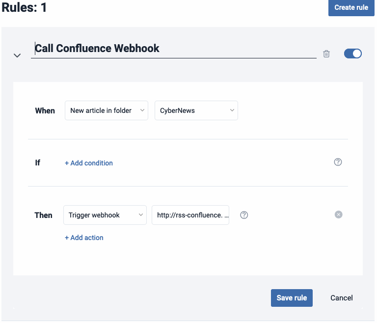

# RSS Confluence Feeder

Containerized webhook which receives a request from [Inoreader](https://www.inoreader.com) 
with customized RSS Feeds content and creates a Confluence Blog Post 
with the title of the content and the hyperlink as the body. This allows 
you to continuously update your team's Space with the latest news or content 
on specific categories you select.

## Prerequisites

Before using this webhook, ensure you have the following prerequisites in place:  

1. **Inoreader**: An Inoreader account with a **Pro** Subscription that allows you 
to create rules.
2. **Confluence API Token**: A Confluence API token to authenticate with your Confluence 
instance.
3. **Docker**: Docker engine in order to build the container image.

## Installation

1. Clone this repository to your local machine:
```shell
git clone https://github.com/derrynEdwards/rss-confluence-feeder.git
```
2. Navigate to the project directory:
```shell
cd rss-confluence-feeder
```
3. Create your `.env` in the directory:
```shell
PORT="8080"
CONFLUENCE_API_USER=""
CONFLUENCE_API_TOKEN=""
CONFLUENCE_API_URL=""
CONFLUENCE_SPACE_ID=""
AUTH_TOKEN=""
```
4. Build the container image:
```shell
docker build --tag {your-registry}/rss-confluence-feeder:latest .
```
5. Run the docker image and expose it on your server or with ngrok.
6. Create the Inoreader Rule so it calls your webhook.


## Configuration

Create the `.env` file with the proper configuration options: 

- `CONFLUENCE_API_USER`: Your email address for your Confluence Instance.
- `CONFLUENCE_API_TOKEN`: Your Confluence API Token
- `CONFLUENCE_API_URL`: Your Confluence Instance URL
- `CONFLUENCE_SPACE_ID`: Your Confluence Space ID where you would like your blog posts.
- `AUTH_TOKEN`: Random generated token to protect your webhook call. Query param `?token=`
